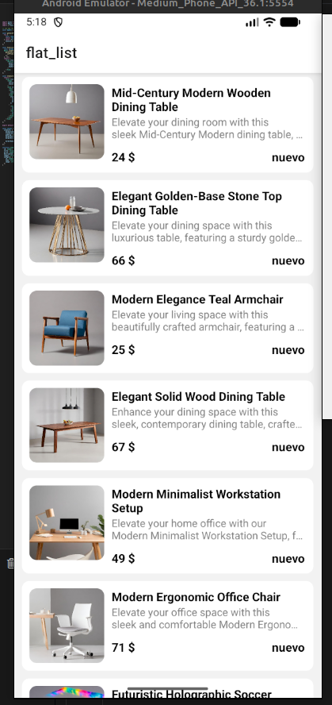

# Full Stack Expo E-Commerce App

A modern, full-stack E-Commerce application built with React Native and Expo. This app features a beautiful, animated UI using Reanimated and Lottie, seamless navigation with Expo Router, and a feature-rich authentication flow.

## 🌟 Features

- **Authentication Flow**: Beautifully designed signup and signin screens with custom animated inputs.
- **Social Login**: Options to log in with Email, Google, Apple, or continue as a Guest.
- **Smooth Animations**: High-quality micro-interactions and transitions using `react-native-reanimated` and `lottie-react-native`.
- **Custom Components**: Reusable UI components including `CustomInput` and `PasswordInput` with built-in toggle visibility.
- **Modern Navigation**: File-based routing powered by Expo Router with stack and bottom tab navigators.
- **Cross-Platform**: Runs seamlessly on both iOS and Android.

## 🛠 Tech Stack

- **Framework**: [React Native](https://reactnative.dev/) & [Expo](https://expo.dev/)
- **Navigation**: [Expo Router](https://docs.expo.dev/router/introduction/) & React Navigation
- **Animations**: `react-native-reanimated`, `lottie-react-native`
- **Icons**: `@expo/vector-icons` (Ionicons, MaterialCommunityIcons, FontAwesome6)
- **Styling**: React Native StyleSheet & Expo Linear Gradient

## 📸 Screenshots & Demo

### Video Demo

Watch the app in action:

<video width="320" height="600" controls>
  <source src="./screen_shots/2026-03-02%2007-35-17.mp4" type="video/mp4">
</video>

Alternatively, you can click here to view the [Video Demo](./screen_shots/2026-03-02%2007-35-17.mp4).

### Screenshots

<p align="center">
  
  
</p>

## 🚀 Getting Started

### Prerequisites

- Node.js (v18 or newer recommended)
- Expo CLI

### 1. Install dependencies

```bash
npm install
```

### 2. Start the development server

```bash
npm run start
# or npx expo start
```

In the output, you'll find options to open the app in a:

- [Development build](https://docs.expo.dev/develop/development-builds/introduction/)
- [Android emulator](https://docs.expo.dev/workflow/android-studio-emulator/)
- [iOS simulator](https://docs.expo.dev/workflow/ios-simulator/)
- [Expo Go](https://expo.dev/go)

## 📁 Project Structure

- **`app/`**: File-based routing components (Screens like Index, Signup, Signin, Tabs).
- **`components/`**: Reusable UI elements (Custom Inputs, Buttons).
- **`constants/`**: Theme colors, fonts, and constant values.
- **`assets/`**: Static images, fonts, and Lottie animations.
- **`screen_shots/`**: Promotional project screenshots and demos.
